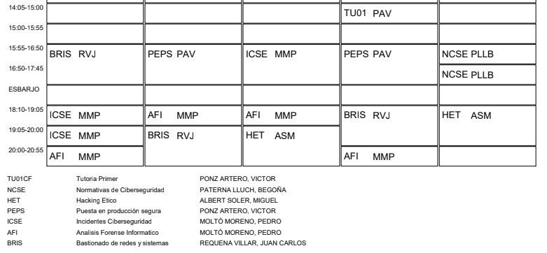

# Curso de especialización en ciberseguridad

  ## ¿Qué es?

* **Denominación**: Ciberseguridad en entornos de las tecnologías de la información.
* **Nivel**: Formación Profesional de Grado Superior.
* **Duración**: 720 horas.
* **Familia Profesional**: Informática y Comunicaciones (únicamente a efectos de
clasificación de las enseñanzas de formación profesional).
* **Rama de conocimiento**: Ingeniería y Arquitectura.
* **Créditos ECTS**: 43.
* Referente en la Clasificación Internacional Normalizada de la Educación: P-5.5.4.
  
## ¿Qué aprenderás en este curso?

* Elaborar e implementar **planes de prevención y concienciación en ciberseguridad** en la organización, aplicando la normativa vigente.

* **Detectar e investigar incidentes de ciberseguridad**, documentándolos e incluyéndolos en los planes de securización de la organización.
* **Diseñar planes de securización** contemplando las mejores prácticas para el bastionado de sistemas y redes.
* **Configurar sistemas de control de acceso y autenticación** en sistemas informáticos, cumpliendo los requisitos de seguridad y minimizando las posibilidades de exposición a ataques.

  ## ¿Qué actividades profesionales podrás llevar a cabo?

Este profesional ejercerá su actividad en entidades de los sectores donde sea necesario establecer mecanismos y medidas para la **protección de los sistemas de información y redes de comunicaciones**.

Las ocupaciones y puestos de trabajo más relevantes son los siguientes:
* Experto/a en ciberseguridad.
* Auditor/a de ciberseguridad.
* Consultor/a de ciberseguridad.
* Hacker ético.

## Entonces, ¿qué módulos comprende este curso?

  ### Incidentes de ciberseguridad
* Este módulo profesional contiene la formación necesaria para desempeñar las **funciones de análisis, detección y respuesta a los incidentes de ciberseguridad** de la organización.
* La función de análisis y detección de incidentes de ciberseguridad incluye aspectos como la monitorización de los sistemas para la **recopilación de evidencias** que permita dar una respuesta adecuada a los incidentes detectados.
* Las **actividades profesionales** asociadas a esta función se aplican mediante la **instalación y configuración de las herramientas necesarias para hacer frente a los ciberataques**

### Bastionado de redes y sistemas
* Este módulo profesional contiene la formación necesaria para desempeñar **la función de bastionado de los sistemas y redes de la organización.**
* La función de bastionado incluye aspectos como la **administración de los sistemas y redes contemplando la normativa**, tanto a nivel nacional como internacional, de ciberseguridad en vigor.
* Las **actividades profesionales** asociadas a esta función se aplican en el diseño de **planes de securización y en el diseño de las redes** contemplando los requisitos de seguridad que apliquen a la organización

### Puesta en producción segura
* Este módulo profesional contiene la formación necesaria para desempeñar **la función de puesta en producción mediante el desarrollo de un sistema de despliegue de software seguro**.
* La función de implantación de un sistema de despliegue seguro incluye aspectos como la **monitorización de aplicaciones y dispositivos para detectar los vectores de ataque más comunes**.
* Las **actividades profesionales** asociadas a esta función se aplican en el **análisis de las aplicaciones web y dispositivos móviles así como en la configuración de servidores web**.

  ### Análisis forense informático
* Este módulo profesional contiene la formación necesaria para desempeñar **la función de análisis forense**.
* La función de análisis forense incluye aspectos como el **análisis de dispositivos de almacenamiento no volátil, de ficheros Logs, dispositivos móviles, Cloud e IoT**.
* Las **actividades profesionales** asociadas a esta función se aplican en la **extracción de las evidencias** para su análisis mediante la estrategia adecuada que garantice la
disponibilidad de los recursos.

  ### Hacking ético
* Este módulo profesional contiene la formación necesaria para desempeñar **la función de detectar las vulnerabilidades de la organización mediante hacking ético**.
* La función de hacking incluye aspectos como el **ataque programado a las redes y a las aplicaciones web** de la organización.
* Las **actividades profesionales** asociadas a esta función se aplican en el ataque de las redes de comunicaciones para acceder a datos o funcionalidades no autorizadas con el propósito de encontrar vulnerabilidades

### Normativa de ciberseguridad
* Este módulo profesional contiene la formación necesaria para desempeñar **la función de diseñar el sistema de cumplimiento normativo** de ciberseguridad en una organización.
* La función de diseñar un sistema de cumplimiento normativo incluye aspectos como la **caracterización de los principales aspectos de las diferentes normativas** de ciberseguridad de obligado cumplimiento para la organización.
* Las **actividades profesionales** asociadas a esta función se aplican en la integración, /de las últimas actualizaciones en normativa de ciberseguridad a nivel nacional e internacional que apliquen, en el sistema de cumplimiento normativo de la organización.

## Entendido. ¿Cómo va a ser la metodología de este curso?
Las metodologías didácticas empleadas serán fundamentalmente procedimentales, basadas en la **realización de ejercicios, tareas y prácticas**, de forma que los contenidos teóricos del módulo pasan a en un segundo plano, dando mayor importancia a los contenidos procedimentales. 

Además, las metodologías utilizadas (**activas, colaborativas y cooperativas**) están enfocadas al hecho que **los estudiantes sean los protagonistas** de su propio aprendizaje.
## Horario

---

## Esto es todo (por ahora)!
### Nos vemos todos los días de 15:55 a 20:55 y en https://aules.edu.gva.es/fp/
